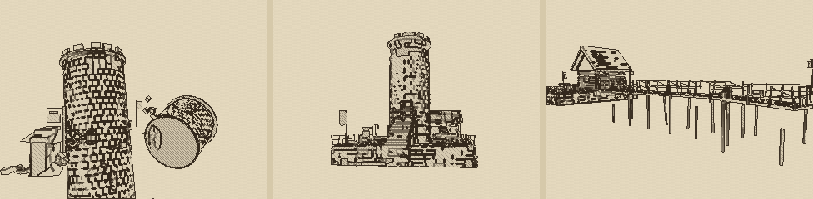

# Tile World

A third person exploration game in Unity. You play a surveyor in an abandoned world, walking around drawing what you find: the animals, the ruins, and the land itself. The world is generated from a seed as you walk into it, so it goes on forever and nothing needs to be stored.

*Two Forester's Watches on a reed lake.*

**Contents:** [The world](#the-world) · [Structures](#structures) · [Animals](#animals) · [The sketchbook](#the-sketchbook) · [The map](#the-map) · [Worlds and saving](#worlds-and-saving) · [Controls](#controls) · [Running it](#running-it) · [Code layout](#code-layout)

## The world

Everything comes from the seed and a position. Terrain height, which tile goes where, which region you're in, where the structures are and even which planks have fallen off them are all recalculated whenever they're needed. A save file is just the seed plus where you've been and what you've found. The same seed always gives you the same world.

The ground is a grid of tiles from a low poly tile pack, streamed in chunks of 15x15 and drawn with GPU instancing. Heights come from layered noise (a large scale mask picks where the mountains go, ridged noise shapes the ranges, smaller noise rolls the ground in between) and snap to steps so the tiles stay flat. A separate collision mesh ramps between the steps so you can walk up a hill instead of catching on every ledge.

*A jetty and a lighthouse at dawn.*

### Regions

The world is split into regions about 240m across. Each one gets a character based on its ground (how high, how wet, how much snow) and a generated name like "the Silent White" or "Weathered Holt". Borders between regions wander instead of running in straight lines, and the last few tiles of one region get mixed into the next so a forest thins out into desert rather than just stopping.

| Region | Where it shows up | What it looks like |
| --- | --- | --- |
| Lowland | low dry ground | meadow, a few trees, fireflies at night |
| Forest | mid height | dense trees over grass |
| Hills | higher | fewer trees, paler ground the higher you go |
| Peaks | mostly above the snowline | bare rock and summits |
| Water | very wet regions | open water with sandy beaches |
| Reedbed | damp but not flooded | reeds in the shallows, dark wet ground |
| Fungal | low ground, rare | giant colourful mushrooms, darker ground |
| Desert | low, dry, open | sand everywhere, cacti, palms, dead trees |
| Snowfield | a plain that stays frozen | deep snow, snow pines, frozen lakes |
| Stone barrens | higher ground, rare | bare rock and boulders, nothing growing |
| Dead wood | low ground, rare | dead standing trees, dark ground |

*The Sand Gate next to an oasis.*

### Water

Water sits at one level across the whole world, and what kind of water it is depends on where you are. In a Water region it's open water with a beach: sand in the shallows, rock deeper down, and a strip of sand above the waterline. Everywhere else it's a lake or a pond (the difference is depth) with a mud bottom and reeds along the edges. In a snowfield the lakes are frozen with a stone bed. Lakes are deep enough to swim in. Walk in and you float, the view goes green and the fog closes in while you're under.

### Snow

Snow covers the ground above the snowline and all of a snowfield, with a ragged edge instead of a clean contour. It's a thick layer that hangs over the edges of the tiles like the grass does on the normal ones, and it has no collider, so you wade through it about a boot deep. Snow-covered trees and pines come with it.

*The Trapper's Cabin, with the desert in the distance.*

### Time and weather

A full day and night takes twenty minutes. Dawn and dusk go orange, night is dark but you can still see, there are stars, and the sky, ambient light and fog all follow the sun. Weather drifts on its own: it clears and clouds over, and when it closes in the light goes flat, shadows soften, the fog pulls in and it rains. Wind picks up with altitude and bad weather, birds sing in the lowlands during the day. All the sound is generated in code, there are no recordings.

## Structures

There are fifteen kinds of structure and each belongs to one kind of region, so if you want to find a biome you can look for what was built there:

| Structure | Region |
| --- | --- |
| Forester's Watch, Hunter's Hide | Forest |
| Trapper's Cabin | Snowfield |
| Sand Gate, Buried Tower | Desert |
| Fishing Jetty | Reedbed |
| Stepped Altar | Stone barrens |
| Toadstool Ring | Fungal |
| Charcoal Camp | Dead wood |
| Hilltop Beacon | Hills |
| Summit Cairn | Peaks |
| Wayside Shrine, Standing Stones | Lowland |
| Lighthouse, Shipwreck | Beaches |

*The Toadstool Ring.*

They're built from a kit of parts: log walls, stone walls, timber framing, plank/thatch/slate roofs, doors, windows, round towers, battlements, piers, and a pile of props. All of it is generated geometry that takes its colours from the tile pack's palette texture, so the buildings use the same material as the ground.

Every structure is a ruin. Each one has a decay value from 0 (intact) to 1 (about to fall over) and every part of the kit reacts to it: wall tops crumble, roofs lose sections, doors hang open or fall off, railings break, windows lose their glass, grass grows through the floor, wood goes grey. On top of that the biome adds its own wear. Vines and moss in the forest, snow on the roofs and drifted against the walls, sand piled up against the gate, char where the camp burned down. Each structure also has its own specific damage, like a hide with one stilt gone that hangs at an angle, a breached wall, a snapped mast, or a lighthouse with the light out.

*The Lighthouse at dusk.*

Walk up to a structure and it gets added to your map with its name, and there's something written at each one. Climb the tall ones and you survey the area around them, which fills in a chunk of the map without having to walk it. Once it's dark you can rest at any structure you've found and skip to morning.

*The Buried Tower.*

## Animals

There are nineteen kinds. Each one sticks to its own biome and its own hours, so what you run into depends on where you are and what time it is.

*A deer walking.*

| Animal | Where | When | What it does |
| --- | --- | --- | --- |
| Deer | wooded lowland | dawn and dusk | grazes in small herds, stags bellow at dusk |
| Rabbit | open meadow | day | hops around, sits up, bolts; foxes hunt them |
| Fox | lowland | night | stays low, pounces; hunts rabbits, marmots and frogs |
| Goat | high bare rock | any | walks along slopes you can't |
| Tortoise | desert | middle of the day | doesn't run, just pulls into its shell and waits |
| Wolf | snowfields | dusk to morning | comes in pairs, backs off but comes back, howls at night; hunts hares |
| Heron | lake shallows | day | stands still and stabs at fish, sometimes catches one; flies off if you push it |
| Boar | dead wood, mushroom woods | most of the day | digs with its snout, turns to face you and stamps before running |
| Raven | dead wood | day | hops around pecking at the ground; flies off |
| Marmot | stone barrens, peaks | day | sits up on rocks on lookout, whistles and dives into a burrow |
| Crab | beaches | any | scuttles sideways, puts its claws up; digs into the sand if you push it |
| Owl | low woods | night | sits on a ruin or a dead tree turning its head |
| Frog | pond edges | dusk and night | sits at the edge croaking with the others, jumps in when you get close |
| Bat | over water | dusk and night | never lands, flits around over the water |
| Hedgehog | low woods | night | curls into a ball, then unrolls and wanders off |
| Fish | deep water | any | hidden under the surface, comes up for a few seconds and leaves a ring |
| Eagle | over the peaks | day | circles way up high on still wings, never lands |
| Hare | snowfields | day | freezes flat when it sees you, then runs faster than anything else |
| Scorpion | desert | night | puts its sting up at you, then burrows into the sand |

*An eagle circling.*

The legs are actual two bone legs with IK, so feet plant on the ground and stay put while the body moves over them instead of sliding, and on a hillside the uphill legs bend more than the downhill ones. Ears and tails are on springs so they lag behind a bit. Every animal gets a random size and a slightly different coat colour, and herds sometimes have young ones that stay close to the adults.

*A hare gone flat.*

They also react to each other. If one animal spooks, everything nearby spooks too a moment later, so a whole herd takes off in a wave and one marmot whistle clears the hillside. Foxes chase rabbits and wolves chase hares. Nothing ever actually gets caught, the hunter lunges at the end and misses, but the chase is fun to watch. Groups follow a leader, wolves howl back at each other, calls get answered, and birds roost at night instead of despawning.

*A fox after a rabbit.*

They leave stuff behind too. Footprints in snow and sand that fade after a few minutes, dug up dirt where a boar has been, a feather where a bird took off, a ring where a fish surfaced, and worn trails where animals keep walking the same way. You can track an animal down from what it left.

*Tracks in the snow.*

How close you can get depends on how you move. Run at them and they bolt. Walk up slowly or stand still and they calm down. A few don't run at all: the tortoise shuts its shell, the hedgehog curls up, the scorpion puts its sting up.

*A scorpion with its sting up.*

## The sketchbook

*The sketchbook's contents.*

Press G. This is the main point of the game.

The book has an entry for every animal and every kind of structure. An animal's entry needs a drawing from up close, something seen of how it behaves, and it found in its home region. A structure's entry needs a drawing with the whole thing on the page, plus reading whatever is written there. The empty entries are what tell you where to go next.

Hold F and the view narrows to what will fit on the page, scroll to zoom. Get close enough, keep it in frame and stand still and the drawing fills in over a few seconds. Moving ruins it. The book grades the result (how much of the page it fills, whether it's cut off, whether you got the side or just the back of it walking away) relative to what's actually possible for that subject, and keeps your best one. The drawing is real: it captures the subject as it was, from where you stood, and renders it as ink on the map paper.

*Three pages from the book, drawn in play: the Buried Tower leaning beside its fallen twin, the Hilltop Beacon, and the Fishing Jetty with its bays down.*

The book also notes things it sees on its own, like three deer together, a fox out at night, or still water after dark. There are about forty of these, none required. When it runs out it tells you what it's curious about, which usually means going out at a time of day you haven't tried.

The first few minutes, on a brand new save only, walk you through this with one animal placed in front of you and a couple of prompts.

## The map

Press M. Chunks you've walked through are shaded by height with water and snow marked. Ground you've only seen from a high point is faded. Structures you've found show as diamonds with their names. Click to place a marker. The compass along the top shows every structure you've found plus your marker. J opens the journal, which lists everything you've found and noticed.

## Worlds and saving

The game saves every thirty seconds and on quit. Escape then Worlds shows all your worlds with name, seed, how much you've charted and when you last played. You can make a new one with whatever name and seed you want, or leave them blank and get random ones.

## Controls

- WASD to move, mouse to look, Shift to sprint, Space to jump
- Walk into deep water to swim
- G for the sketchbook, hold F to draw, scroll to zoom while drawing
- M for the map, J for the journal
- E to rest at a structure you've found (night only)
- Click the map to place a marker, right click to remove it
- F9 saves the map as an image, F3 shows world stats
- Escape closes whatever is open, or pauses
- F8 (editor and dev builds only) opens the dev tools: teleport to the nearest region or water type, replay the intro, or wipe the save

## Running it

Open the project in Unity 6000.2.13f1 and load `Assets/Scenes/SampleScene`. World Seed on the WorldCreator object is 0 by default, which gives a random world every run. View Radius is the draw distance in chunks. The screenshots here are at the max of 8; if it runs badly, turn that down first.

## Code layout

- `World/` - the grid, terrain function, chunks and collision, water, snow, regions, planting, streaming
- `Landmarks/` - structure placement, the building kit, weathering, inscriptions
- `Player/` - the character model and animation, follow camera, swimming, underwater view
- `Interface/` - map, journal, sketchbook, compass, notices, intro, pause menu, worlds screen
- `Wildlife/` - what lives where, how animals are built and move, their behaviour, the field guide
- `Atmosphere/` - day cycle, weather, wind, birdsong, music, rain, stars, fireflies
- `Systems/` - saving, the worlds library, dev tools

For how the code is organised, what has to stay true, and how to build and screenshot the game from the command line without opening the editor, see [docs/HANDBOOK.md](docs/HANDBOOK.md). The scripts it mentions are in `Tools/`.
