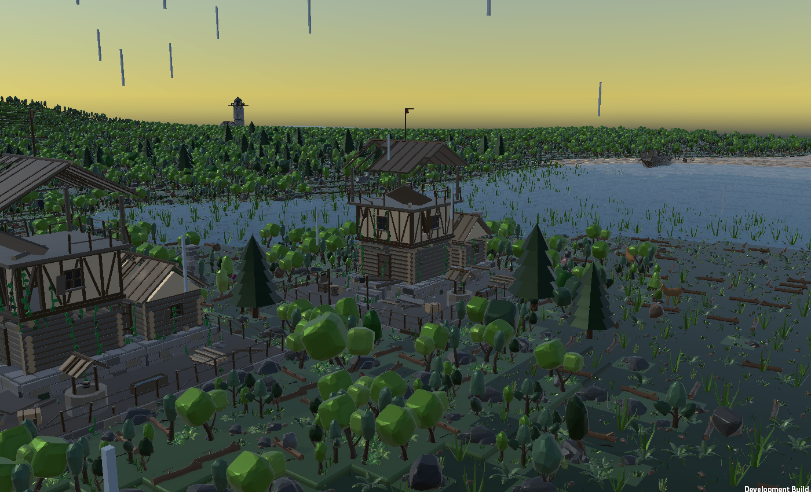
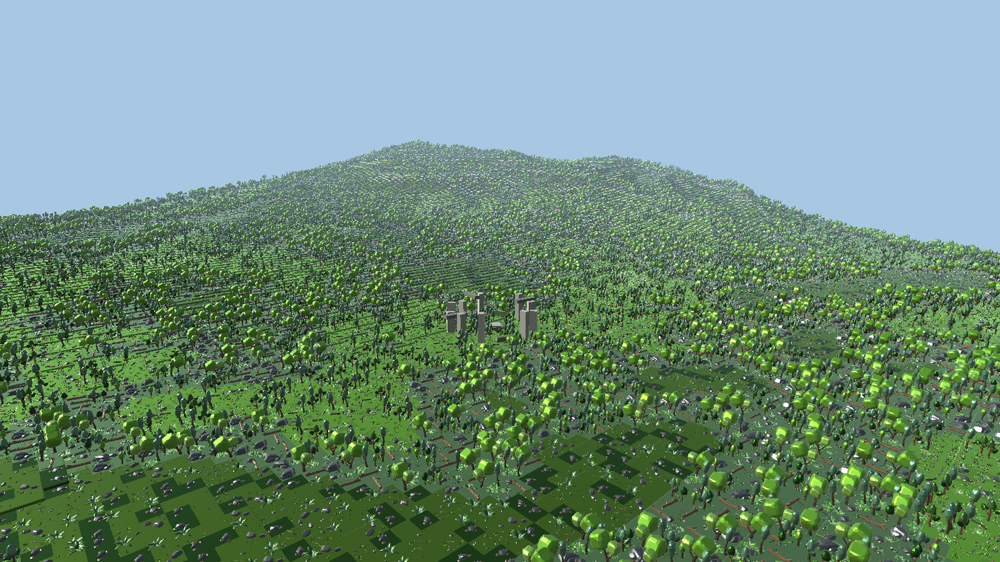
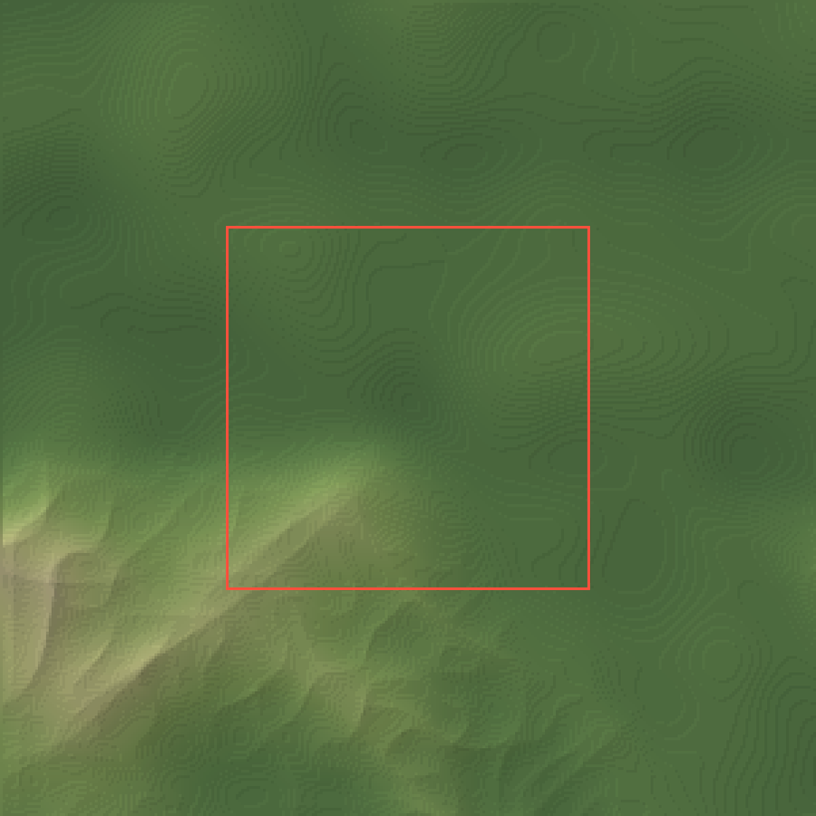
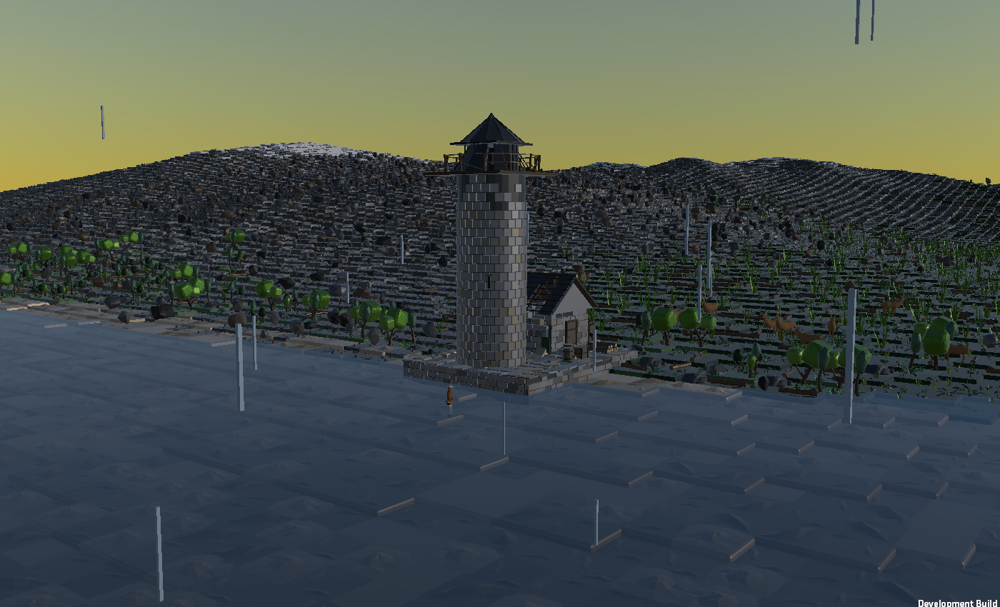
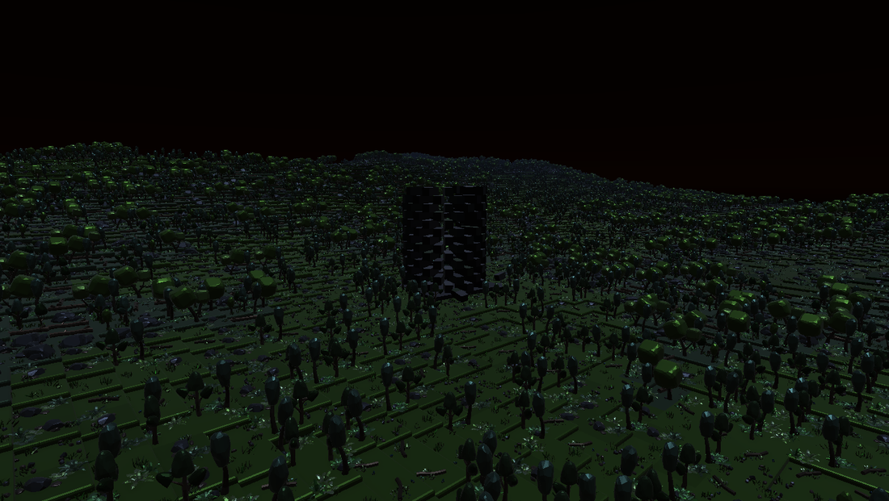
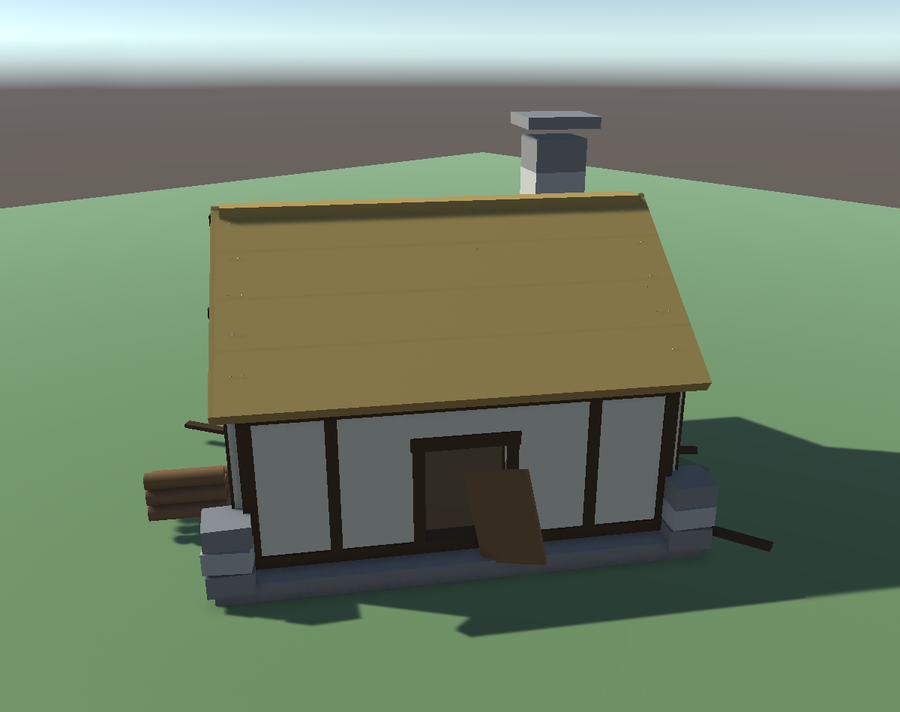
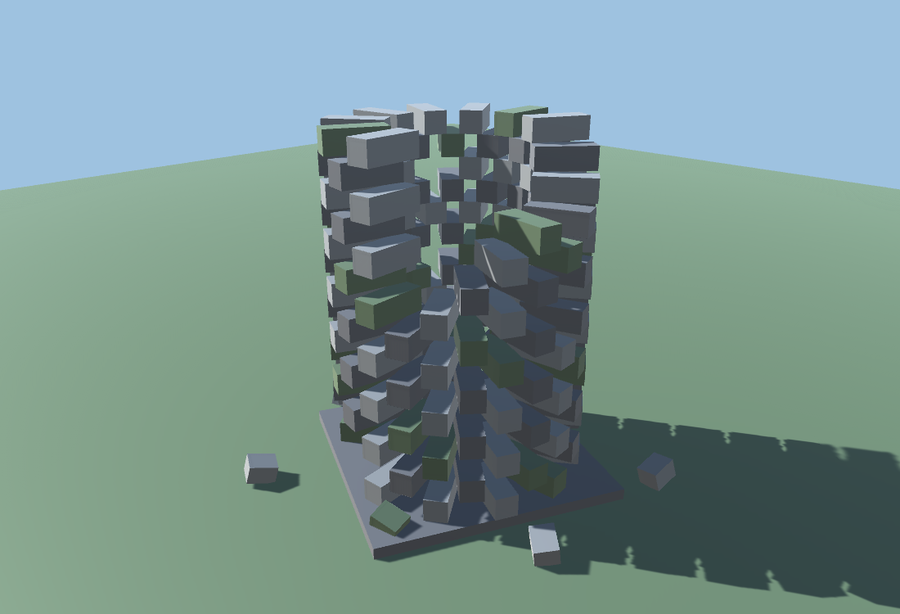
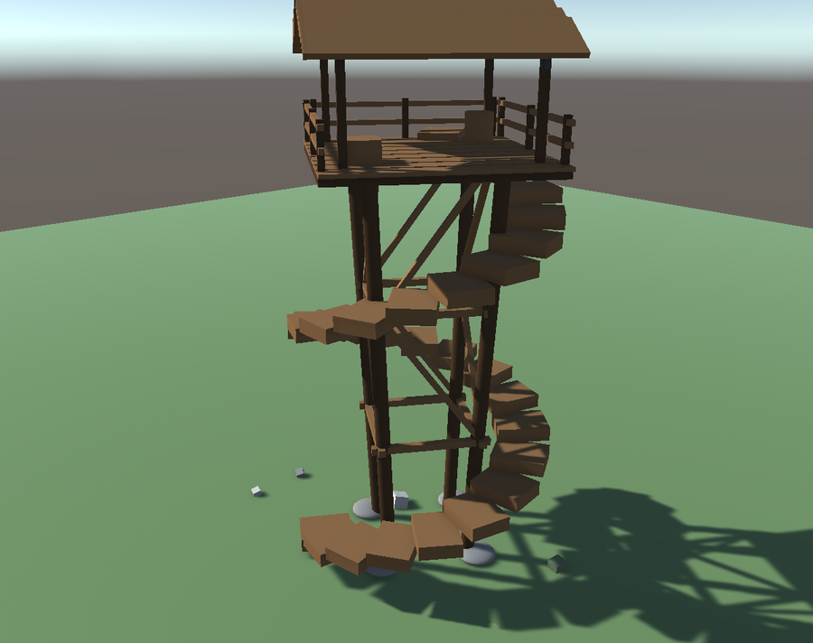
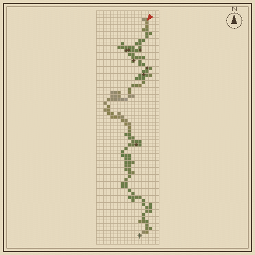

# Map the Unknown

A third person exploration game in Unity. The world is generated procedurally in chunks as you walk into it, and you fill in a map as you go.

## About

I built this to learn how procedural world generation works. The world is infinite and comes entirely from a seed, so nothing gets saved to disk and the same seed always gives you the same world.

## The world

Terrain is layered noise. A large scale mask decides which regions get mountains, ridged noise shapes the ranges themselves, and smaller noise rolls the ground in between. Heights snap to steps of 0.25 so the tiles stay flat instead of tilting.

Collision does not follow those steps. The character controller can only step up 0.25, so a terraced collider would catch you on every ledge. There is a separate collision mesh that slopes between tile centres instead, which turns each step into a shallow ramp you can walk up. The meshes overlap by one tile at chunk borders so there is nothing to fall through at the seams.

Which tile goes where follows the height and the steepness rather than its own separate noise, so the ground gets paler as it climbs, steep faces go bare, and there is a treeline: trees thin out with altitude and stop entirely near the top. Lowlands come out about a third trees, the ground around a summit under a tenth, and above the treeline almost none.

## Time and weather

The sun moves. A full day and night takes twenty minutes by default and you can change that on the Time of Day object. Dawn and dusk go orange and the light rakes across the forest, night is dark but still light enough to navigate by, and the sky, the ambient light and the fog all follow along.

Weather drifts on its own. It clears and clouds over on a slow noise curve, and when it closes in the sun goes flat and grey, shadows soften and fog pulls the horizon in close.

## Landmarks

Some chunks have a structure in them. There are four: an abandoned house with the roof half gone, a ruined tower, a stone circle, and a timber watchtower.

They are built out of primitives, but built as buildings: the cottage is timber framed with plaster panels between the beams, on a stone plinth with a chimney and a thatched roof that has partly fallen in. The tower is coursed stone with the courses knocked slightly out of true, an arched doorway, crenellations and a stair inside. Every piece is placed from a seeded random, so a structure you walk away from and come back to is the same one.

They are placed from the seed like everything else, so they are always in the same spot for a given world. The game checks the ground across the whole footprint first and skips anywhere too uneven to build on, and keeps them away from chunk edges so one never gets cut in half by a border.

Walk up to one and it gets marked on your map. The two towers are worth more than that. Both have a staircase you can climb, and getting to the top charts the land around you without walking it, which fills in a big circle of your map at once. The house and the stone circle reveal a little just for reaching them.

That gives you something to aim at. You spot a tower over the trees, walk to it, climb it, and the map fills in far enough to show you where to go next.

## The map

Press M. Chunks you have been through are shaded by height, everything else is left blank, and landmarks you have found show up as diamonds. Ground you have only seen from the top of a tower is drawn faded, so you can tell where you have actually been. The arrow is you.

## Time and saving

The world saves itself every thirty seconds and when you quit. Almost nothing needs storing, since the terrain, the tiles and the landmarks all come from the seed: a save is the seed plus where you have been, what you have seen from a tower, which landmarks you reached, the time and where you stood. So you come back to the same world with your chart intact.

You can keep more than one. Escape, then Worlds, lists what you have made: each with its name, its seed, how much of it you have charted, how many landmarks you found in it and when you were last there. Make a new one with a name and a seed of your choosing, or leave either blank and take what you are given - an unnamed world is called after the ground it starts on. Picking one saves the world you are in first, so wandering off to see a different seed costs you nothing. Worlds can be forgotten too, which takes two presses.

There is a compass across the top showing which way you are facing, with a mark for every landmark you have found nearby and for anywhere you have marked on the map. Landmarks you have already reached carry their name out in the world. Finishing a quest or reaching something shows up as a note in the corner, and the field journal lists everything found, nearest first.

Nights have stars, fireflies come out in the lowlands, and there is standing water in about one chunk in ten. Snow covers the ground above the snowline, which is roughly eight percent of the world, with a ragged edge rather than a contour line. Wind rises with altitude and with the weather, so an exposed ridge in bad weather sounds like one, birds call in the daytime lowlands, and it rains when the overcast gets heavy. Wind and birdsong are generated in code rather than recorded.

Lakes are deep enough to swim in. Walk into one and you float at the surface rather than strolling along the bottom, the view goes green and the fog closes in while your head is under, and the map shows water and snow as well as height.

## Quests

Press Q. Six of them, all based on where you have been: explore new chunks, get a certain distance from spawn, reach all four compass directions, find landmarks, climb towers, and survey a larger area.

## Controls

- WASD to move, mouse to look
- Left Shift to sprint, Space to jump
- Q for the quest log, M for the map
- E to rest at a landmark you have found, once it is dark
- Scroll to zoom the map, F9 to save it as an image
- J for the field journal, F3 for world statistics
- Click the map to mark a spot, right click to clear it
- Escape backs out of whatever is open, then pauses

## Running it

Open the project in Unity 6000.2.13f1 and load `Assets/Scenes/SampleScene`.

Most of the settings are on the WorldCreator object. World Seed is 0 by default, which picks a random world each run; set it to a number if you want the same one every time. View Radius controls draw distance. If it runs badly, turn that down before anything else.

## Notes on the code

Chunks are generated when you get near them and dropped once you are well past. The visible set only gets rebuilt when you cross a chunk border rather than every frame.

Tiles are drawn with GPU instancing. Chunks get frustum tested each frame and the visible ones are copied into one buffer per tile type, so the number of draw calls depends on how many kinds of tile there are and not on view distance. The tile meshes are heavy, around 3900 vertices each, so culling matters a lot here and tiles do not cast shadows by default.

Nothing derived is stored. Terrain height, tile choice and landmark placement are all recalculated from the seed whenever they are needed. The only things actually tracked are which chunks you have visited and which landmarks you have found.

The landmark structures are built out of primitives because the tile pack does not have any buildings in it. Placement and discovery go through a struct and never touch the geometry, so swapping in real models only means changing `LandmarkBuilder.Build`.

## Layout

Scripts are grouped under `Assets/Scripts`:

- `World/` - the grid and the terrain function, chunks and their collision, water, snow, regions, and the streaming in `ChunkManager`
- `Landmarks/` - where structures go, what they are built from, and what is written at them
- `Player/` - the follow camera, swimming, and the underwater view
- `Interface/` - the map, journal, quest log, compass, notices, pause menu and statistics overlay
- `Atmosphere/` - the day cycle and weather, wind, birdsong, music, rain, stars and fireflies
- `Systems/` - what has been found, the library of saved worlds, and what is kept between sessions
