# Tile World

A third person exploration game in Unity. You play a surveyor in an abandoned world, walking around drawing what you find: the animals, the ruins, and the land itself. The world is generated from a seed as you walk into it, so it goes on forever and nothing needs to be stored.

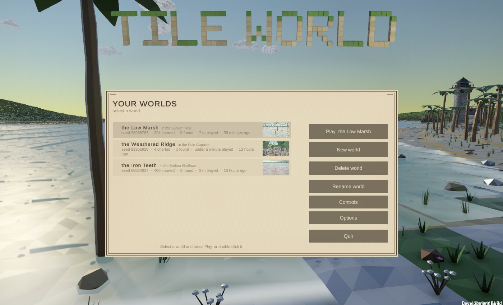

*The title screen. The beach behind it is a real place in the game, with the sea running up the sand.*

**Contents:** [The world](#the-world) · [The ground](#the-ground) · [Structures](#structures) · [Animals](#animals) · [The sketchbook](#the-sketchbook) · [The map](#the-map) · [Worlds and saving](#worlds-and-saving) · [Controls](#controls) · [Running it](#running-it) · [Code layout](#code-layout)

## The world

Everything comes from the seed and a position. Terrain height, which tile goes where, which region you're in, where the structures are and even which planks have fallen off them are all recalculated whenever they're needed. A save file is just the seed plus where you've been and what you've found. The same seed always gives you the same world.

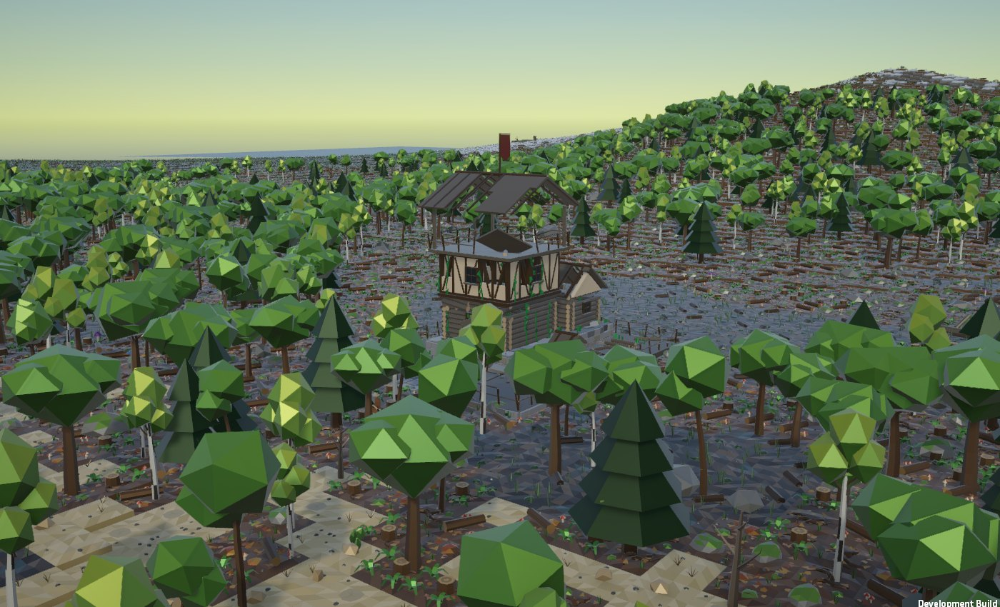

*A Forester's Watch in the woods.*

The ground is a grid of tiles, streamed in chunks of 15x15 and drawn with GPU instancing. Heights come from layered noise (a large scale mask picks where the mountains go, ridged noise shapes the ranges, smaller noise rolls the ground in between) and snap to steps so the tiles stay flat. The collider you walk on is flat across each tile and ramps only where a neighbour is too tall to step onto, so you can walk up a hill without catching on every ledge or sinking into the edge of one.

### Regions

The world is split into regions about 240m across. Each one gets a character based on its ground (how high, how wet, how much snow) and a generated name like "the Silent White" or "Weathered Holt". Borders between regions wander instead of running in straight lines, and the last twenty-odd tiles of one region get mixed into the next in patches and fingers, so a forest thins out into desert rather than just stopping. Where two grounds meet there is mixed ground between them: the fourteen grounds in the world are five things to look at, sand, grass, dark floor, rock and snow, and every pair of those has a series of five tiles graded from one into the other. Both sides walk toward the middle of the series, so a jungle runs out into sand over twenty-odd tiles rather than stopping at a line. A shore has its own verge as well, from sand with a tuft in it to turf with sand showing through.

| Region | Where it shows up | What it looks like |
| --- | --- | --- |
| Lowland | low dry ground | meadow with flowers, a few trees, fireflies at night |
| Forest | mid height | oaks, beeches and birches over a floor of leaf litter, roots and logs |
| Hills | higher | fewer trees, paler grass the higher you go, scree on the steep faces |
| Peaks | mostly above the snowline | frost-split rock, thin turf, lichen, erratics, wind-bent trees at the treeline |
| Water | very wet regions | open water with sandy beaches, shells, driftwood, palms |
| Reef | some of the warmest, lowest wet regions | coral under shallow sea, seagrass, urchins, sand channels |
| Jungle | low warm ground with water in it | giant trees over a closed canopy, bamboo, tree ferns, vines |
| Reedbed | damp but not flooded | reeds in the shallows, wet mud with puddles |
| Fungal | low ground, rare | giant toadstools over dark loam, glowing caps |
| Desert | low, dry, open | sand everywhere, cacti, dead trees, a palm now and then |
| Snowfield | a plain that stays frozen | deep snow, laden spruces and firs, bare birches, frozen lakes |
| Stone barrens | higher ground, rare | slabs of rock and boulders, lichen, nothing growing |
| Dead wood | low ground, rare | dead standing trees over ash, charred wood, old bones |

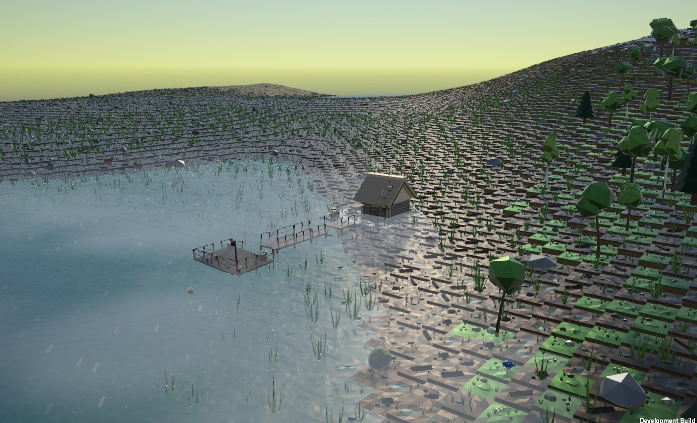

*A jetty on a lake at dawn.*

### The high country

The peaks have ground of their own: rock split flat by the frost, thin dry turf worked in between it, lichen over the stone in pale green and yellow, snow lying in the lee with ice down in the cracks, and boulders the ice left behind. What grows there is low and bent. Cushion plants flower on the rock, mountain tussock leans all one way, and at the treeline itself there are krummholz, trees that have given up growing upward: the trunk leans away from the weather, every branch grows downwind, the top is shorn level and the windward side is dead. They thin out and stop as you climb, which is how you know where the treeline is.

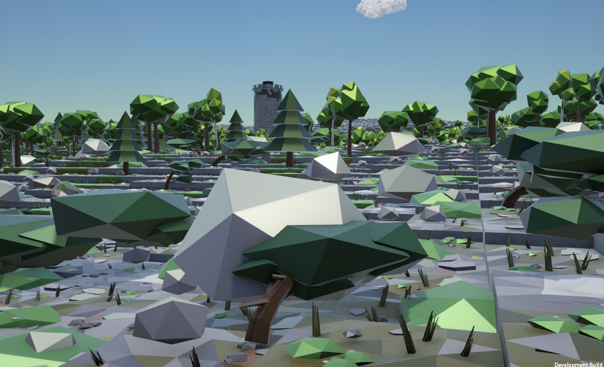

*The high country, with krummholz leaning away from the weather and a Summit Cairn behind.*

### Jungle

Low warm country with water in it grows jungle. The trees are the tallest in the world by a long way: the giants stand twenty metres, ten tiles, against six and a half for the biggest oak, on buttress roots you can walk between, with vines hanging off the crown. Under them is a second layer of ordinary jungle trees and stranglers, then bamboo, then tree ferns and seedlings on a floor of rotted leaf, buttress roots, fallen trunks and standing water. It is dense enough that you cannot see far through it, and dark underneath.

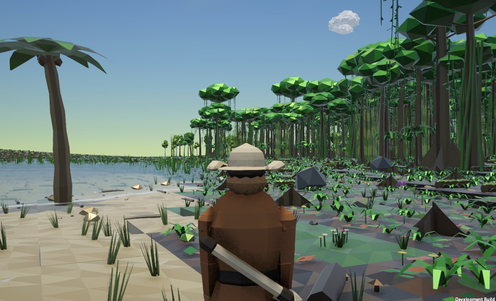

*A jungle running down to a bay, with a lighthouse and a wreck below it.*

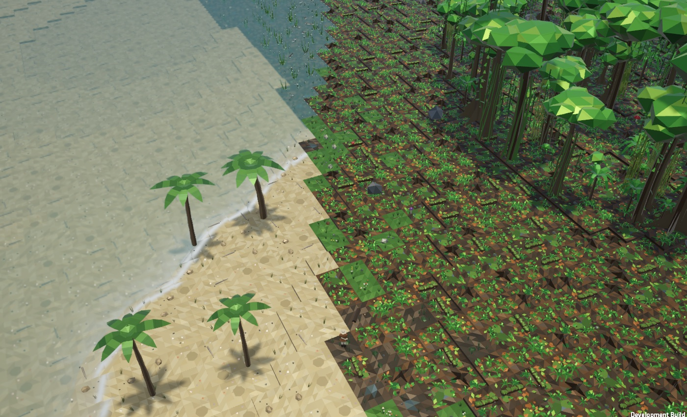

*The canopy from above, where it meets the shore.*

### Water

Water sits at one level across the whole world, and what kind of water it is depends on where you are. The bottom falls away from the shore, so a sea has a middle to it and gets to about six metres deep. In a Water region it's open water with a beach: sand in the shallows, rock deeper down, and a strip of sand above the waterline. Everywhere else it's a lake or a pond (the difference is depth) with a mud bottom and reeds along the edges. In a snowfield the lakes are frozen with a stone bed. Lakes are deep enough to swim in. Walk in and you float, the view goes green and the fog closes in while you're under.

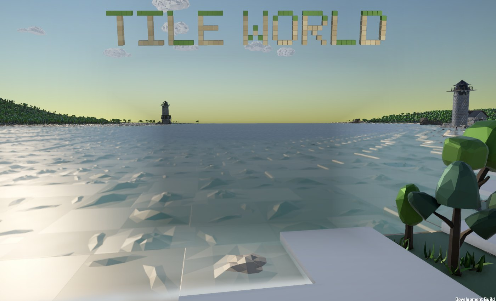

*A beach. The sea runs up the sand and back, over and over.*

Some of the warmest, lowest stretches of sea are reef. Out where the water is over a metre deep the floor is coral instead of sand: heads, tables, fans, sponges and pillars standing up off it, seagrass, urchins and old white rubble, with sand channels blown between. The shallows over it stay sand, so a reef has an ordinary beach and an ordinary wash, and the coral keeps under the surface. You find one by looking down into the water on your way past, or by swimming out over it.

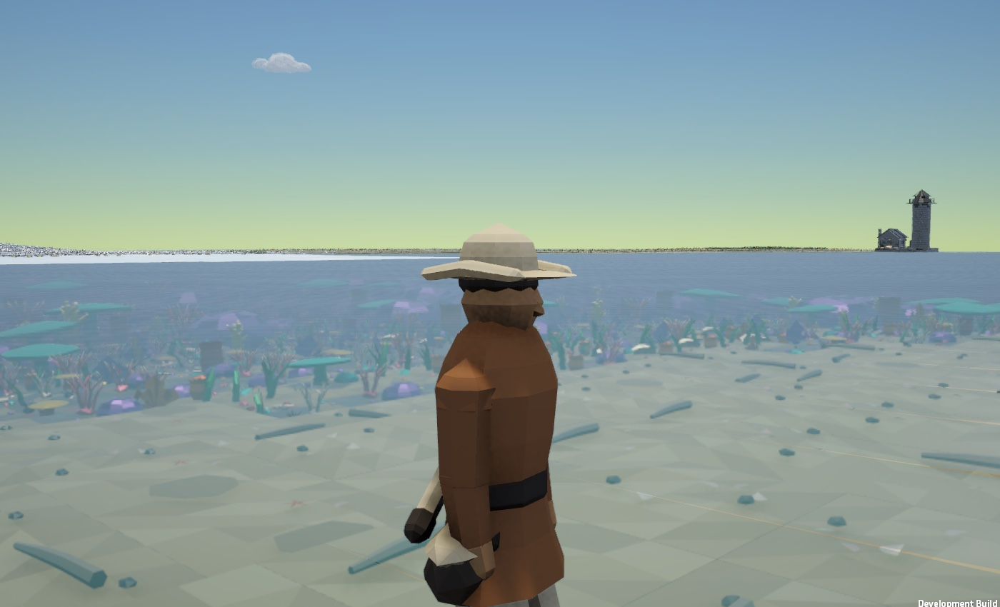

*A reef from its own shore, with a lighthouse standing at the end of it.*

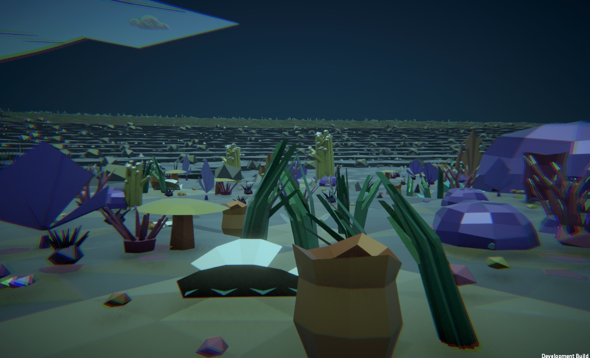

*The same reef from under the water.*

Walking into water throws up a few drops and leaves a ring on the surface with every step, more the faster you go and the deeper it is. Going in off a bank makes a proper splash. Swimming leaves a ring with each stroke and a wake behind you. Animals wading do the same. When it rains you hear it everywhere, and by a lake you hear it on the water too; every drop that lands on the water rings it. A downpour brings lightning, with the thunder a few seconds behind it, and the ground takes on a wet sheen that dries off once the sun is back. On the beaches the sea runs up the sand, sits a moment, and slides back. The white line of foam is the water's edge: everything behind it is water, everything ahead of it is sand, and when the wave draws back it bares the wet sand before the next one comes. You hear the surf as you come near. In the snow country it snows instead, your breath shows, and the lakes are frozen: you can walk across them, though the ice is slippery and creaks under you, and hares and wolves cross it too. In snow and sand you leave boot prints, and after a swim you drip for a while.

### Snow

Snow covers the ground above the snowline and all of a snowfield, with a ragged edge instead of a clean contour. The snow tiles have drifts, rocks showing through, frozen puddles, bare shrubs with snow on them, and tracks. Snow trees come with it: spruces and firs with snow on every bough, and bare birches.

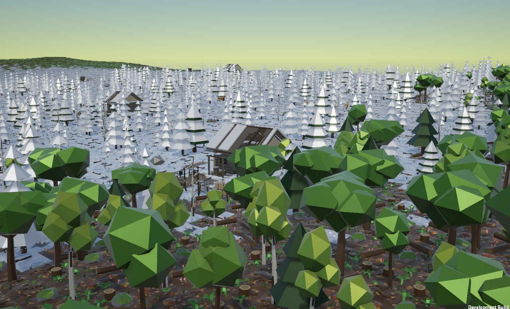

*The Trapper's Cabin, at the edge of the snow.*

### Time and weather

A full day and night takes twenty minutes. Dawn and dusk go orange, night is dark but you can still see, there are stars, and the sky, ambient light and fog all follow the sun. Weather drifts on its own: it clears and clouds over, and when it closes in the light goes flat, shadows soften, the fog pulls in and it rains. Wind picks up with altitude and bad weather, birds sing in the lowlands during the day and gulls cry over the water. All the sound is generated in code, there are no recordings.

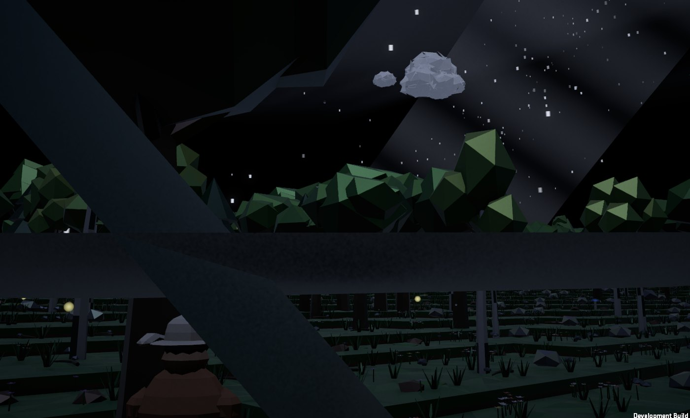

*A night on the low ground. Stars, and fireflies under the trees.*

The picture is graded: tonemapped so sunsets don't clip, a little bloom on the sun and the water, a soft vignette, and a colour grade that follows the clock and the weather. Dawn and dusk are warm, rain is grey and washed out, the snow country is blue-white, and night lifts the shadows a little blue instead of going black. The water has its own shader: clear and green in the shallows, dark in the deep, the bed seen through it and bent a little, the sun glinting off a surface that moves. At night the moon is up, and it glints on the water too. There are clouds: puffy ones drifting on the wind that thicken as the weather closes in, a grey ceiling with breaks in it when it's overcast, and thin high cloud in clear weather that takes the sunset. When the sky is partly clouded, their shadows drift over the land. Fireflies come out after dark on the low ground. At night there's a proper sky: a few thousand stars, the Milky Way, and a shooting star now and then. Mist lies on the lakes and in the hollows at dawn and burns off by mid-morning. When the sun comes out after rain there's a rainbow. By day, flocks of birds cross the sky. When the sun is low in a wood, shafts of it come down between the trees. The grass and reeds lean in the wind, and the trees a little. Leaves turn down through the woods, seeds ride the wind over the low ground, dust hangs over the sand.

## The ground

Every tile in the world, and every tree, bush, mushroom and stone on it, is made by the project's own scripts in Blender. The scripts are in `Tools/` and they rebuild the whole set on demand. The game started on a bought tile pack; of that pack only the colour sheet remains, and the new pieces paint their colours into its blank cells so everything still draws as one batch.

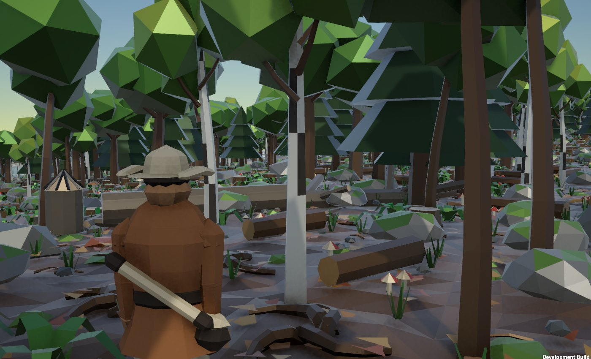

*The forest floor: leaf litter, roots, a fallen log, ferns round a stump, moss on a boulder.*

The grounds so far: the forest floor; grass in three shades by height, with tufts, flowers, clover, molehills and lichened rocks; wet marsh with puddles and sedge; beach sand with shells and driftwood; desert sand with ripples, a cracked pan and scrub; slabs of stone for the barrens and scree for the steep faces; snow; the fungal country's dark loam; the ash of the dead woods; and the coral floor of a reef. Plain fill goes under any tile where the ground drops away, so a cliff is solid to its foot.

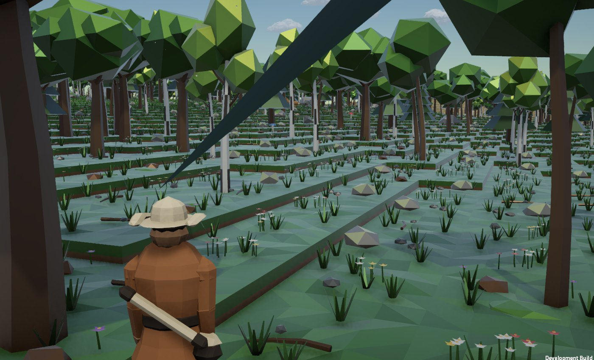

*Grass on the low ground, with the trees planted rather than built into the tiles.*

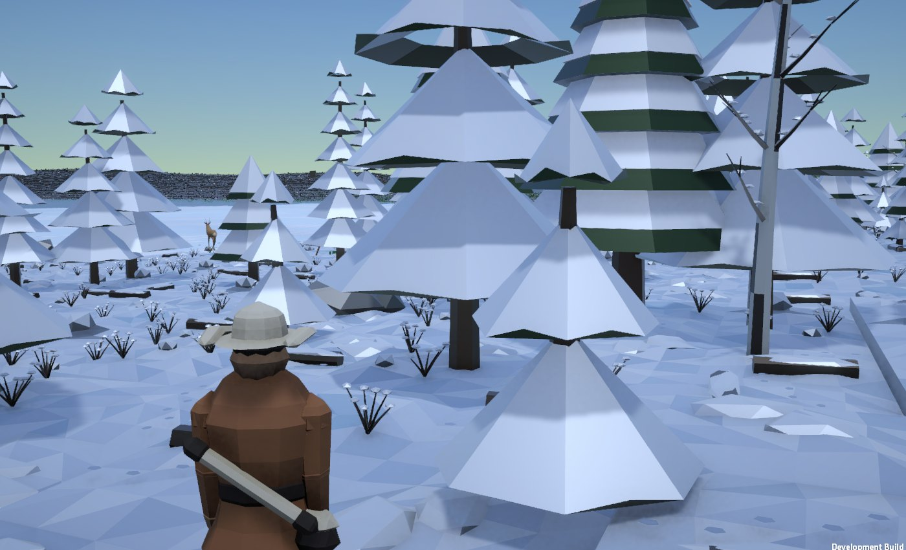

*A snowfield.*

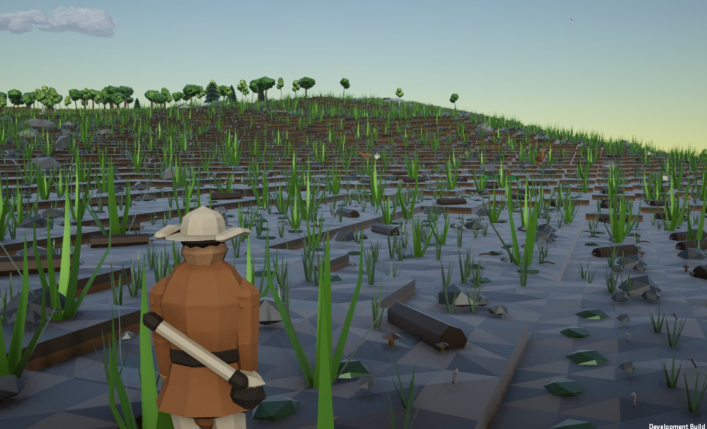

*A reedbed.*

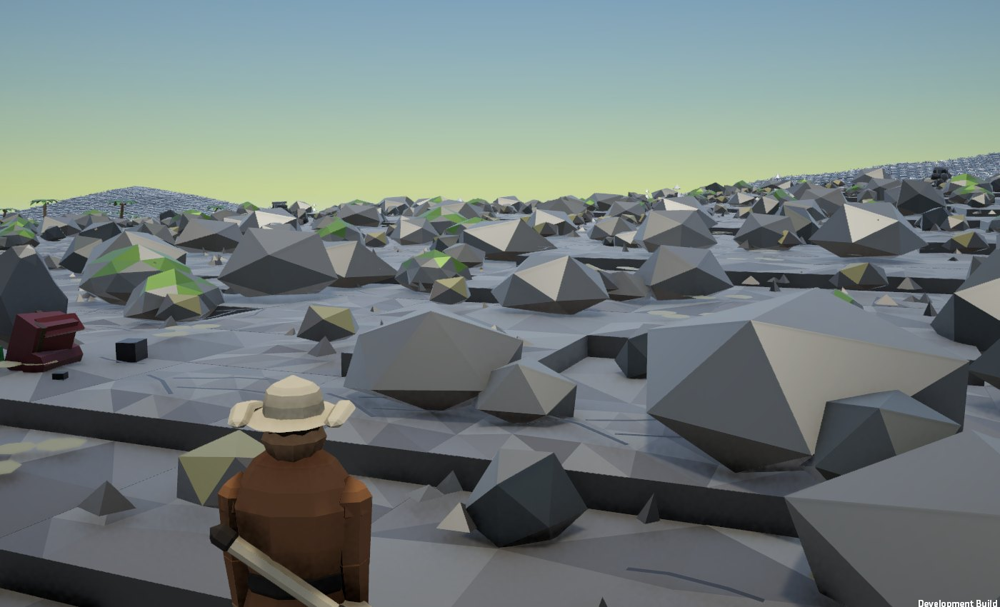

*The stone barrens.*

## Structures

There are fifteen kinds of structure and each belongs to one kind of region, so if you want to find a biome you can look for what was built there:

| Structure | Region |
| --- | --- |
| Forester's Watch, Hunter's Hide | Forest |
| Trapper's Cabin | Snowfield |
| Sand Gate, Buried Tower | Desert |
| Fishing Jetty | Reedbed |
| Stepped Altar | Stone barrens |
| Toadstool Ring | Fungal |
| Charcoal Camp | Dead wood |
| Hilltop Beacon | Hills |
| Summit Cairn | Peaks |
| Wayside Shrine, Standing Stones | Lowland |
| Lighthouse, Shipwreck | Beaches |

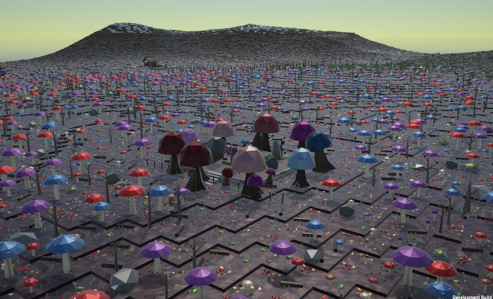

*The fungal country.*

They're built from a kit of parts: log walls, stone walls, timber framing, plank/thatch/slate roofs, doors, windows, round towers, battlements, piers, and a pile of props. All of it is generated geometry, coloured from the same colour sheet as the ground.

Every structure is a ruin. Each one has a decay value from 0 (intact) to 1 (about to fall over) and every part of the kit reacts to it: wall tops crumble, roofs lose sections, doors hang open or fall off, railings break, windows lose their glass, grass grows through the floor, wood goes grey. On top of that the biome adds its own wear. Vines and moss in the forest, snow on the roofs and drifted against the walls, sand piled up against the gate, char where the camp burned down. Each structure also has its own specific damage, like a hide with one stilt gone that hangs at an angle, a breached wall, a snapped mast, or a lighthouse with the light out.

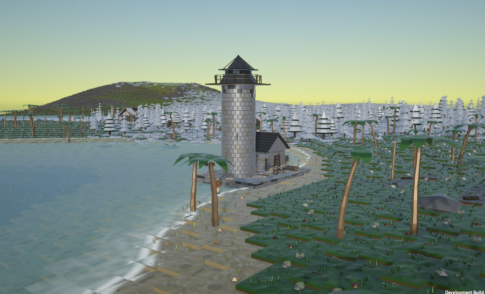

*The Lighthouse at dusk.*

Walk up to a structure and it gets added to your map with its name, and there's something written at each one. Climb the tall ones and you survey the area around them, which fills in a chunk of the map without having to walk it. Once it's dark you can rest at any structure you've found and skip to morning.

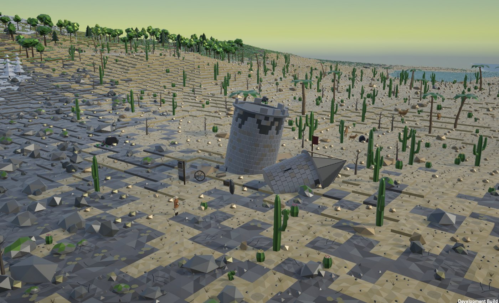

*The Buried Tower.*

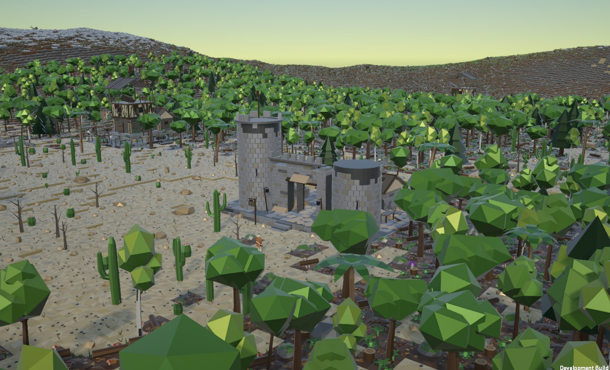

*The Sand Gate, where the desert meets the woods.*

### Small finds

Between the ruins there are smaller things to come across: a fallen tree, a dead fire, a dropped pack, a snare, a waymark cairn, a broken cart. About one chunk in six has one, on level dry ground, and never in a chunk that has a ruin. They belong to regions too. Fallen trees and snares are in the woods and the snow, waymarks on the high ground, carts on the low ground and in the sand, and fires nearly anywhere somebody might have camped. Walking up to one names it and tells you what you noticed about it. Each sort has a page in the book that wants a drawing. They don't go on the map.

## Animals

There are nineteen kinds. Each one sticks to its own biome and its own hours, so what you run into depends on where you are and what time it is.

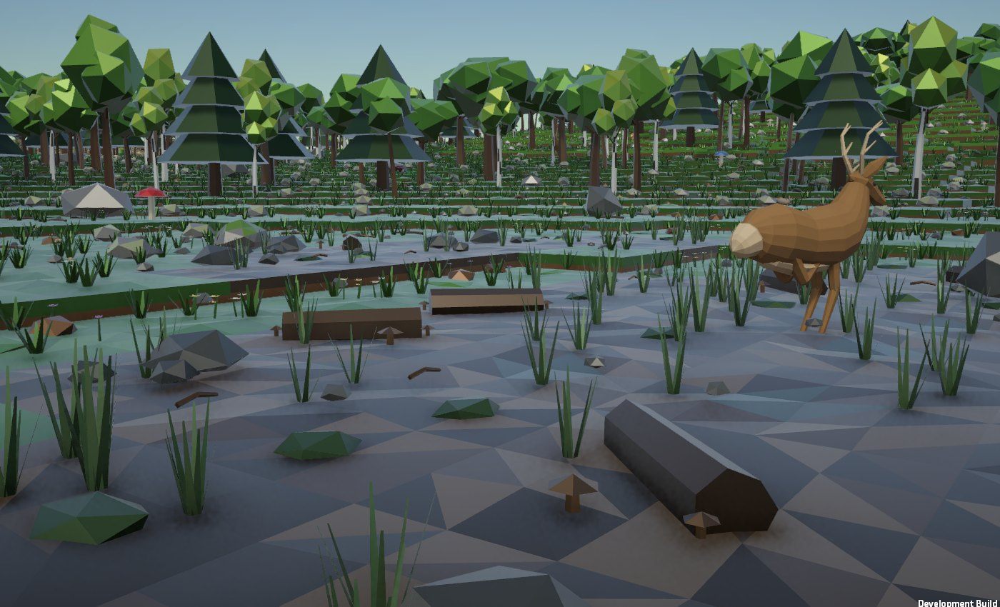

*A stag on the meadow.*

| Animal | Where | When | What it does |
| --- | --- | --- | --- |
| Deer | wooded lowland | dawn and dusk | grazes in small herds, stags bellow at dusk |
| Rabbit | open meadow | day | hops around, sits up, bolts; foxes hunt them |
| Fox | lowland | night | stays low, pounces; hunts rabbits, marmots and frogs |
| Goat | high bare rock | any | walks along slopes you can't |
| Tortoise | desert | middle of the day | doesn't run, just pulls into its shell and waits |
| Wolf | snowfields | dusk to morning | comes in pairs, backs off but comes back, howls at night; hunts hares |
| Heron | lake shallows | day | stands still and stabs at fish, sometimes catches one; flies off if you push it |
| Boar | dead wood, mushroom woods | most of the day | digs with its snout, turns to face you and stamps before running |
| Raven | dead wood | day | hops around pecking at the ground; flies off |
| Marmot | stone barrens, peaks | day | sits up on rocks on lookout, whistles and dives into a burrow |
| Crab | beaches | any | scuttles sideways, puts its claws up; digs into the sand if you push it |
| Owl | low woods | night | sits on a ruin or a dead tree turning its head |
| Frog | pond edges | dusk and night | sits at the edge croaking with the others, jumps in when you get close |
| Bat | over water | dusk and night | never lands, flits around over the water |
| Hedgehog | low woods | night | curls into a ball, then unrolls and wanders off |
| Fish | deep water | any | hidden under the surface, comes up for a few seconds and leaves a ring |
| Eagle | over the peaks | day | circles way up high on still wings, never lands |
| Hare | snowfields | day | freezes flat when it sees you, then runs faster than anything else |
| Scorpion | desert | night | puts its sting up at you, then burrows into the sand |

*An eagle circling.*

The legs are actual two bone legs with IK, so feet plant on the ground and stay put while the body moves over them instead of sliding, and on a hillside the uphill legs bend more than the downhill ones. Ears and tails are on springs so they lag behind a bit. Every animal gets a random size and a slightly different coat colour, and herds sometimes have young ones that stay close to the adults.

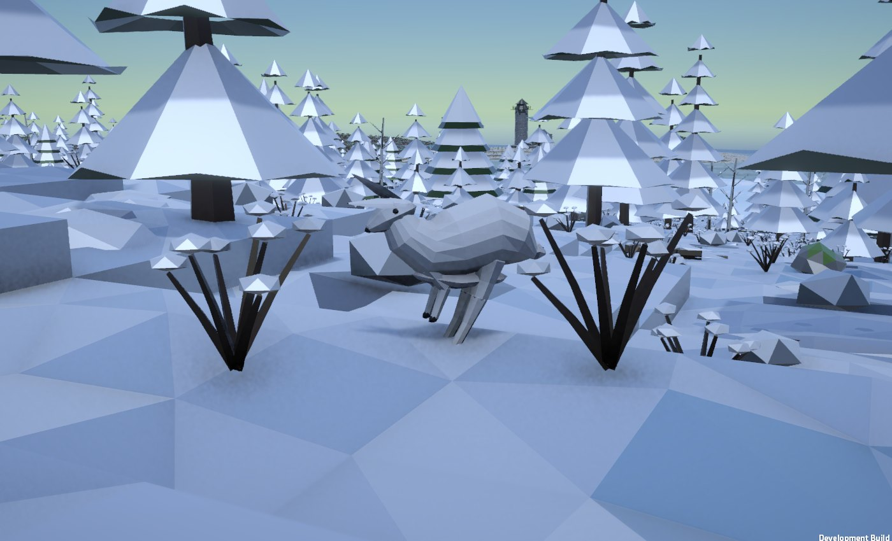

*A hare in the snow.*

They also react to each other. If one animal spooks, everything nearby spooks too a moment later, so a whole herd takes off in a wave and one marmot whistle clears the hillside. Foxes chase rabbits and wolves chase hares. Nothing ever actually gets caught, the hunter lunges at the end and misses, but the chase is fun to watch. Groups follow a leader, wolves howl back at each other, calls get answered, and birds roost at night instead of despawning.

*A fox after a rabbit.*

They leave stuff behind too. Footprints in snow and sand that fade after a few minutes, dug up dirt where a boar has been, a feather where a bird took off, a ring where a fish surfaced, and worn trails where animals keep walking the same way. You can track an animal down from what it left.

*Tracks in the snow.*

How close you can get depends on how you move. Run at them and they bolt. Walk up slowly or stand still and they calm down. A few don't run at all: the tortoise shuts its shell, the hedgehog curls up, the scorpion puts its sting up.

*A scorpion with its sting up.*

## The sketchbook

*The sketchbook's contents.*

Press G. This is the main point of the game.

The book has an entry for every animal and every kind of structure. An animal's entry is a set of plates to draw: standing, on the move, lying down, and whatever that animal does that nothing else does. A deer wants one in a herd and a stag bellowing at dusk, a wolf wants one howling and the pair together, a heron wants one fishing, one with a fish in its beak, and one in the air, a tortoise wants one pulled into its shell. One drawing can fill more than one plate if the animal happened to be doing both. Once you have a plate of an animal its page carries a few lines on how it lives. A structure's entry needs a drawing with the whole thing on the page, plus reading whatever is written there. The empty plates are what tell you where to go next.

Hold F and the view narrows to what will fit on the page, scroll to zoom. Get close enough, keep it in frame and stand still and the drawing fills in over a few seconds. Moving ruins it. The book grades the result (how much of the page it fills, whether it's cut off, whether you got the side or just the back of it walking away) relative to what's actually possible for that subject, and keeps your best one. The drawing is real: it captures the subject as it was, from where you stood, and renders it as ink on the map paper.

*Three pages from the book, drawn in play: the Buried Tower leaning beside its fallen twin, the Hilltop Beacon, and the Fishing Jetty with its bays down.*

While you're lining up a drawing the hint at the bottom names the plates it would fill, so you know before you commit whether this one is worth it.

The first few minutes, on a brand new save only, walk you through this with one animal placed in front of you and a couple of prompts.

## The map

Press M. Chunks you've walked through are shaded by height with water and snow marked. Ground you've only seen from a high point is faded. Structures you've found show as diamonds with their names. Click to place a marker. The compass along the top shows every structure you've found plus your marker. J opens the journal, which lists everything you've found.

*A map saved with F9: a long walk south, with the ruins found on the way.*

## Worlds and saving

The game opens on a title screen. The name is in blocks at the top and behind the menu is a beach in a world of its own, drawn out to the horizon: the sea runs up the sand and back, clouds go over, crabs sit on the sand and a heron stands in the shallows, and you hear the surf and a soft pad. It's morning, afternoon, dusk or night there depending on the time where you are. Left alone for a while, the menu steps aside so the beach stands on its own until you touch something.

The menu lists the worlds you've kept: seed, how much you've charted, what you've found, where you are, how long you've played and when. Each row has a small picture of the last thing you saw there, and the list scrolls past six. Pick one and press Play, or Enter; the arrows move the choice. Worlds can be renamed, and a deleted one can be brought back for ten seconds. New world takes a name and a seed (or leaves them random) plus world settings: weather on or off, day cycle on or off, start time, day length, animals on or off, ruins on or off. Preview seed shows you the country of the seed you've typed behind the menu before you commit to it. Those settings are fixed when the world is created. Escape in a world gives you Main menu, which saves and goes back to the title.

Options has volume, view distance, mouse look speed, fullscreen and the title's music, kept between runs. Controls shows every key and lets you change it: click one, press the new key. Reset to defaults puts them back.

The game saves every thirty seconds, on quit, and on the way back to the title.

## Controls

These are the defaults. All of them can be changed on the title's Controls page.

- WASD to move, mouse to look, Shift to sprint, Space to jump
- Walk into deep water to swim
- G for the sketchbook, hold F to draw, scroll to zoom while drawing
- M for the map, J for the journal
- E to rest at a structure you've found (night only)
- Click the map to place a marker, right click to remove it
- F9 saves the map as an image, F3 shows world stats
- Escape closes whatever is open, or pauses; the pause menu has Main menu
- F8 (editor and dev builds only) opens the dev tools. Places: teleport to the nearest region, water type, frozen lake, structure or small find, replay the intro, wipe the save. Animals: put any kind down in front of you, stage a herd, a wolf pair or a fox hunting a rabbit, tell everything nearby to walk, run, rest, spook or hunt. Weather: hold the sky at clear, cloudy, light rain, rain or a downpour, let it go again, give it a minute of rain, set the hour, slow time.

## Running it

Open the project in Unity 6000.2.13f1 and press Play in `Assets/Scenes/SampleScene`. The game opens on the title, in the editor as in a build. View distance is set in Options; the screenshots here are at the maximum of 8 chunks, and if it runs badly, turn that down first.

The pictures in this file were taken from a development build by a script, with the interface hidden. The four animal pictures that don't show much ground are older than the rest.

## Code layout

- `World/` - the grid, terrain function, chunks and collision, water, snow, regions, planting, streaming
- `Landmarks/` - structure placement, the building kit, weathering, inscriptions
- `Player/` - the character model and animation, follow camera, swimming, underwater view
- `Interface/` - map, journal, sketchbook, compass, notices, intro, pause menu, title
- `Wildlife/` - what lives where, how animals are built and move, their behaviour, the field guide
- `Atmosphere/` - day cycle, weather, wind, birdsong, rain, stars, fireflies, clouds
- `Systems/` - saving, the worlds library, keys, dev tools
- `Tools/` - the Blender scripts that build the tiles, trees and plants, and the probes that check the game

For how the code is organised, what has to stay true, and how to build and screenshot the game from the command line without opening the editor, see [docs/HANDBOOK.md](docs/HANDBOOK.md).
